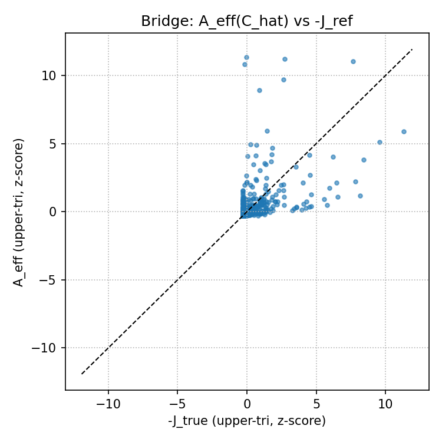

# Inverse Ising ↔ Consumer–Resource: an unsupervised stat-mech bridge

**TL;DR**  
**A)** *Inverse Ising (pseudo-likelihood)* recovers pairwise couplings $J$ from binary snapshots using node-wise logistic regressions with L1-CV.  
**B)** *Consumer–Resource (MacArthur)* learns preferences $C$ and maintenance $m$ from time series and checks feasibility & stability.  
**Bridge.** The *effective competition* $A_{\mathrm{eff}} = C\,D^{-1}C^\top$ predicts Ising couplings via $J \approx -\kappa\,A_{\mathrm{eff}}$.  
On synthetic data we observe Pearson $r \approx 0.53$, ROC-AUC $\approx 0.89$ for edge detection.

<p align="center">
  
</p>

---

## 1. Motivation

Pairwise graphical models are powerful but phenomenological; mechanistic ecological models (MacArthur CR) are interpretable but require dynamics.  
This repo demonstrates both ends and an interpretable **bridge**:

- from **dynamics** → **preferences** $(C,m)$ → **effective competition** $A_{\mathrm{eff}}$,
- which aligns with **pairwise couplings** $J$ inferred from snapshots.

---

## 2. What’s inside

### Part A — Inverse Ising (pseudo-likelihood)

- Node-wise logistic regressions (**SAGA**, $\ell_1$): `LogisticRegressionCV` with hold-out conditional log-loss.
- Gibbs sampling to generate synthetic snapshots.
- Recovery metrics: Pearson correlation (upper-tri), ROC-AUC / PR-AUC (edge detection), MSE, sign accuracy, asymmetry of raw coefficients.
- Optional ablations over sample size, density, inverse temperature $\beta$.

### Part B — Consumer–Resource (MacArthur)

We simulate
$$
\dot R = s - d\!\circ\! R - R\!\circ\!(C^\top n), \qquad 
\dot n = n\!\circ\!(C R - m),
$$
build per-species regressions for $ \tfrac{1}{n_i}\tfrac{dn_i}{dt} \approx C_i\!\cdot\! R - m_i $,  
fit **LassoCV** (`positive=True`) for $C$ and $m$, and optionally NNLS-refine $C$ at fixed $\hat m$.  
We then:
- check feasibility (fraction $n_i>0$ at steady state) and stationarity residuals,
- assess local stability via Jacobian eigen-spectrum.

### Bridge — $A_{\mathrm{eff}}(C) \leftrightarrow J$

- Build $A_{\mathrm{eff}} = C D^{-1} C^\top$; compare to $-J_{\text{ref}}$ (either `J_true` exported from CR or `J_hat` from inverse Ising).
- Report correlation & ROC/PR; estimate scale $\kappa$ in $J \approx -\kappa A_{\mathrm{eff}}$.

---

## 3. Quick start

### Environment
```bash
python -m venv .venv && source .venv/bin/activate   # or: conda create -n ising-cr python=3.10 && conda activate ising-cr
pip install -r requirements.txt
